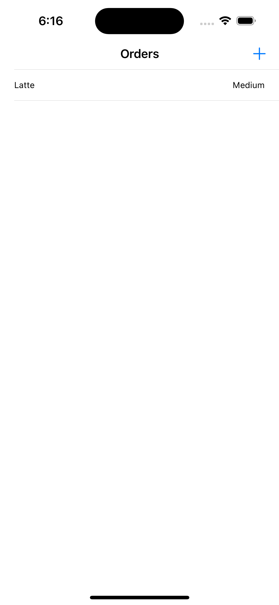
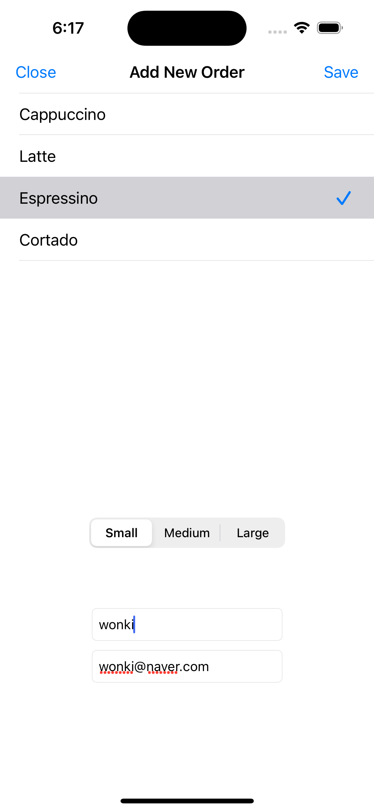
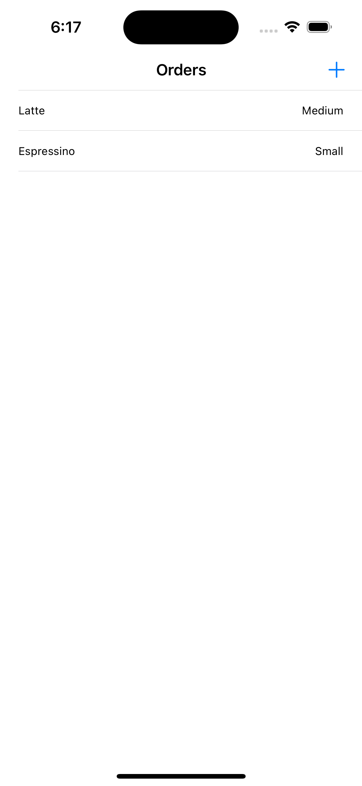

# HotCoffee

### 학습 사항
- MMVM Design Pattern (Models, View - ViewControllers, View Models, Services...)

   
### App Screenshot
|Order List|Add Coffee Order|Result|
|-|-|-|
||||

### 아쉬운 점.
이 강의가 만들어진지 오래됬는지 MVVM 패턴을 구현하는데 핵심이 되는 Combine(Reactive Framework), SwiftUI가 쓰이지 않았음.

### 출처
[Udemy MVVM - Mohammad Azam](https://www.udemy.com/course/mastering-mvvm-for-ios/)